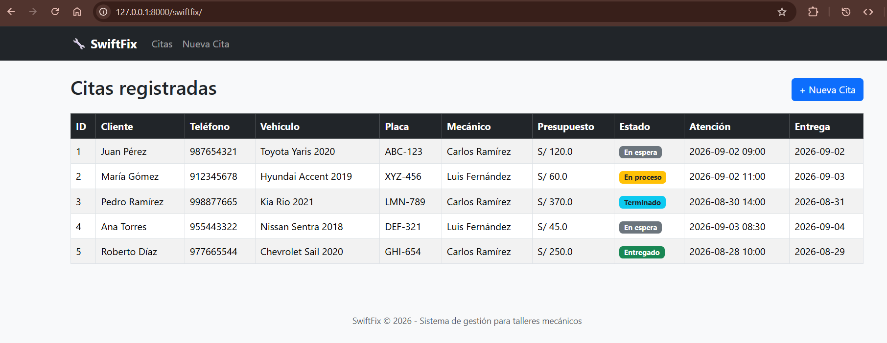
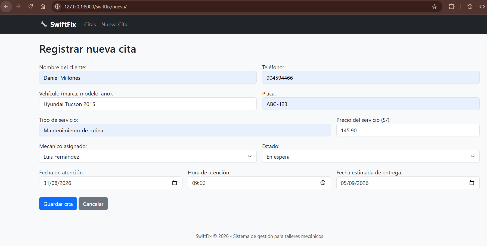
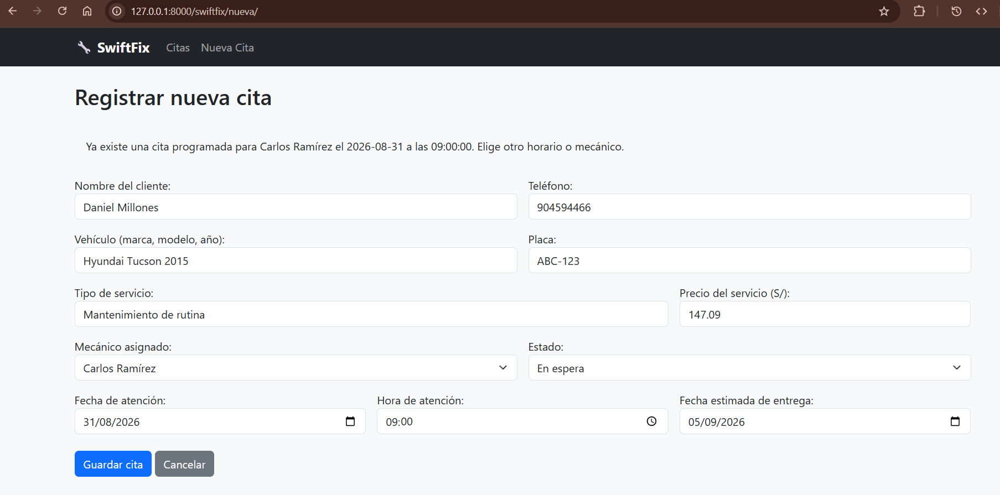
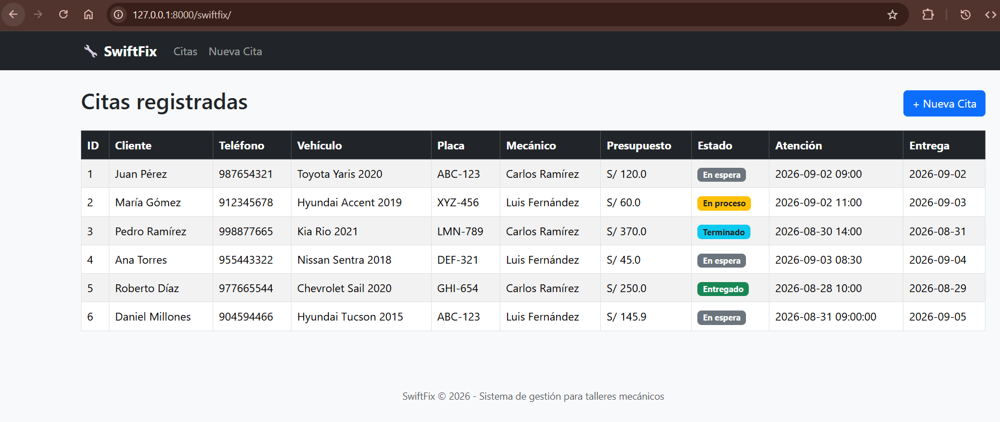

# SwiftFix — Sistema de gestión para talleres mecánicos

Proyecto desarrollado para el curso **Desarrollo de Aplicaciones Empresariales**.

**Autor:** Bestard Aroche, Yunior
**Sección:** 4-C24-CD

---

## Ejercicio 1 — Problemática

Los talleres mecánicos registran de forma manual las reparaciones, repuestos,
presupuestos y citas de sus clientes, usando cuadernos o mensajes de WhatsApp.
Esto genera pérdida de información, presupuestos imprecisos, cruces de citas
y demoras en informar a los clientes sobre el estado de su vehículo. El
sistema sería usado por el dueño del taller, los mecánicos y los clientes.

## Ejercicio 2 — Requisitos funcionales

- El sistema debe permitir registrar los datos del cliente.
- El sistema debe permitir registrar los vehículos asociados a cada cliente.
- El sistema debe permitir agendar citas para el ingreso de vehículos al taller.
- El sistema debe permitir asignar un mecánico y uno o más servicios a cada cita.
- El sistema debe permitir calcular el presupuesto en base a los servicios asignados.
- El sistema debe permitir validar que no existan cruces de horario para un mismo mecánico.
- El sistema debe permitir consultar el listado de citas junto con su estado
  (En espera, En proceso, Terminado, Entregado).

> Nota: la lista completa de requisitos capturados (12 en total) se encuentra
> en el documento de requisitos entregado junto con este repositorio. Dado el
> alcance del laboratorio (una sola entidad, sin base de datos), esta App
> implementa el subconjunto de requisitos relacionados directamente con el
> ciclo de vida de una **Cita**.

## Ejercicio 3 — Modelo de datos

**Entidad principal:** `Cita`. Se eligió porque concentra y relaciona a todos
los actores de la problemática (cliente, vehículo, mecánico, servicios).

| Campo | Tipo | Obligatorio | Descripción |
|---|---|---|---|
| id | int | Sí | Identificador único de la cita. |
| cliente.nombre | String | Sí | Nombre del cliente. |
| cliente.telefono | String | Sí | Contacto para informar el estado del vehículo. |
| cliente.vehiculo.descripcion | String | Sí | Marca, modelo y año del vehículo. |
| cliente.vehiculo.placa | String | Sí | Identifica al vehículo; permite su historial. |
| cliente.vehiculo.servicios | List | Sí | Lista de servicios `{tipo, precio}`; base del presupuesto. |
| cliente.vehiculo.mecanico | String | Sí | Responsable asignado a la reparación. |
| cliente.vehiculo.estado | String | Sí | Avance del trabajo: En espera / En proceso / Terminado / Entregado. |
| cliente.vehiculo.programacion_atencion | String (fecha + hora) | Sí | Día y hora de ingreso al taller; evita cruces de citas. |
| cliente.vehiculo.fecha_entrega | Date | Sí | Fecha estimada de entrega del vehículo. |

El **presupuesto** no se almacena como campo fijo: se calcula dinámicamente
sumando el precio de cada servicio (`calcular_presupuesto()` en `models.py`).

## Arquitectura (MVT)

El proyecto sigue el patrón **Model - View - Template** de Django:

- **`config/`** — Project. Contiene la configuración global y el enrutamiento
  principal (`urls.py`), que delega hacia las apps mediante `include()`.
- **`core/`** — App base. Provee la plantilla compartida `base.html`
  (navbar, Bootstrap, footer) que las demás apps heredan. No tiene URLs
  propias porque su aporte ocurre a nivel de Template, no de rutas.
- **`taller/`** — App funcional (Ejercicio 4). Contiene toda la lógica de
  negocio: modelo de datos en memoria, formulario, vistas y templates.

### Cómo `taller` se conecta con `core` (Ejercicio 9)

La conexión entre ambas apps ocurre **exclusivamente a nivel de Template**:

- `core` no define `urlpatterns` propios; su única función es alojar
  `core/templates/core/base.html`, la plantilla maestra con la estructura
  común del sitio (navbar, Bootstrap, footer).
- Los templates de `taller` (`lista_citas.html`, `crear_cita.html`) heredan
  esa estructura con `` y solo definen su
  contenido específico dentro de ``.
- Ambas apps conviven dentro del mismo Project (`config`), registradas en
  `INSTALLED_APPS`, y `config/urls.py` es el único punto donde se conoce la
  ruta pública de `taller` (`swiftfix/`), manteniendo a `core` como una app
  de soporte reutilizable por cualquier otra app futura del proyecto.

### Recorrido Request → Response (Ejercicio 9)

Ejemplo con el flujo de creación de una cita:

1. **Request** — El usuario envía un `POST` a `/swiftfix/nueva/` desde el
   formulario.
2. **URL** — `config/urls.py` delega a `taller/urls.py`, que resuelve la
   ruta hacia la vista `crear_cita`.
3. **View** — `taller/views.py` valida el formulario (`CitaForm`), verifica
   que no exista cruce de horario (`existe_cruce_horario`) y, si todo es
   correcto, llama a `agregar_cita()`.
4. **Model** — `taller/models.py` no usa base de datos: la "persistencia"
   es una lista de diccionarios (`citas`) en memoria, a la que se agrega el
   nuevo registro.
5. **Template** — La vista redirige a `lista_citas`, que renderiza
   `lista_citas.html` (heredando de `core/base.html`) mostrando el listado
   actualizado, incluyendo la nueva cita.
6. **Response** — El navegador recibe el HTML final con el listado
   actualizado.

## Datos estáticos (sin base de datos)

Según el alcance del laboratorio, esta App **no usa base de datos ni
migraciones**. Los datos se almacenan en una lista de diccionarios dentro de
`taller/models.py` (variable `citas`), que actúa como fuente única de datos
en memoria, con funciones auxiliares:

- `calcular_presupuesto(servicios)` — suma el precio de los servicios de una cita.
- `obtener_siguiente_id()` — genera el ID de una nueva cita.
- `existe_cruce_horario(programacion, mecanico)` — evita agendar dos citas
  para el mismo mecánico en el mismo horario.
- `agregar_cita(datos)` — agrega una nueva cita a la lista en memoria.

⚠️ **Importante:** los datos agregados mediante el formulario se pierden al
reiniciar el servidor, ya que no hay persistencia real en base de datos.
Esto es **esperado**, según el alcance definido para este laboratorio.

## Estructura del proyecto

```
swiftfix/
├── requirements.txt
├── README.md
├── .gitignore
└── src/
    ├── manage.py
    ├── config/                  # Project
    │   ├── settings.py
    │   └── urls.py
    ├── core/                    # App base
    │   └── templates/core/
    │       └── base.html
    └── taller/                  # App funcional (Ejercicio 4)
        ├── models.py            # Datos estáticos + lógica (Ejercicio 5)
        ├── forms.py             # CitaForm (Ejercicio 7)
        ├── views.py             # lista_citas, crear_cita (Ejercicios 6 y 8)
        ├── urls.py
        └── templates/taller/
            ├── lista_citas.html
            └── crear_cita.html
```

## Cómo ejecutar el proyecto

```bash
# Clonar el repositorio
git clone https://github.com/TU_USUARIO/swiftfix.git
cd swiftfix

# Crear y activar entorno virtual
python -m venv venv
venv\Scripts\activate      # Windows
source venv/bin/activate   # Linux/Mac

# Instalar dependencias
pip install -r requirements.txt

# Ejecutar el servidor
cd src
python manage.py runserver
```

Abrir en el navegador: `http://127.0.0.1:8000/swiftfix/`

## Casos de prueba

| # | Caso | Resultado esperado |
|---|---|---|
| 1 | Entrar a `/swiftfix/` | Se muestra el listado con las 5 citas de ejemplo. |
| 2 | Ir a "Nueva Cita" y registrar una cita en un horario libre | La cita se agrega y se muestra en el listado al redirigir. |
| 3 | Registrar una cita con el mismo mecánico y horario de una cita existente | El sistema muestra un mensaje de error y no guarda la cita. |
| 4 | Reiniciar el servidor | Las citas agregadas manualmente se pierden (comportamiento esperado, sin base de datos). |

## Capturas de pantalla (Ejercicio 9)

Evidencia del recorrido completo Request → URL → View → Model → Template → Response.

### Listado de citas



### Formulario de creación de cita



### Validación de cruce de horario



### Nueva cita reflejada en el listado

