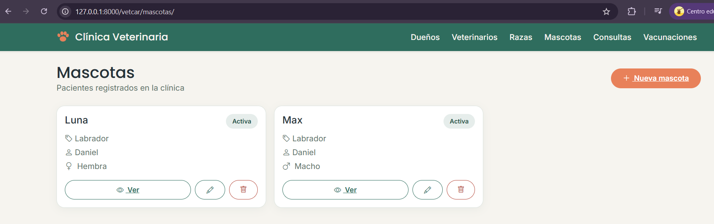
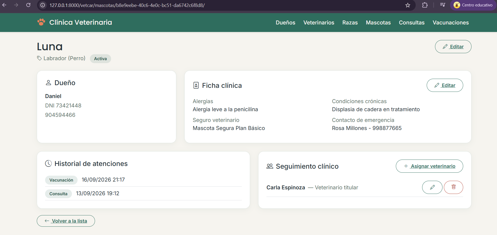
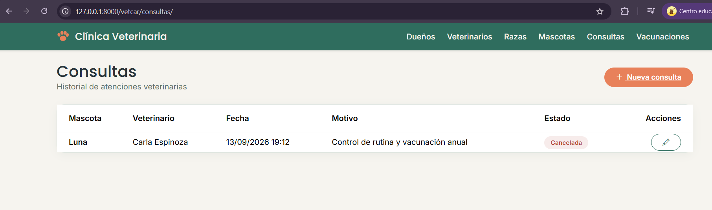
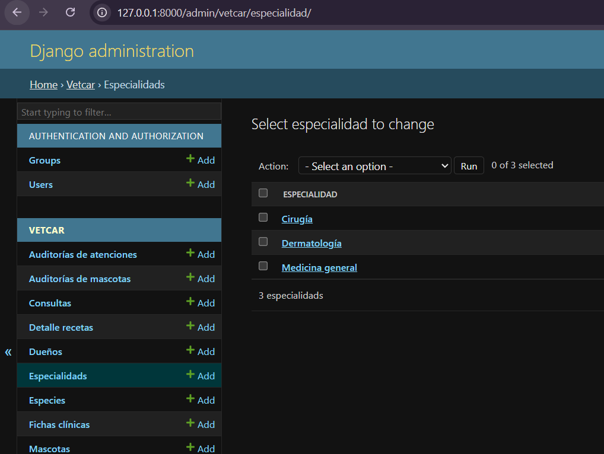

# VetCar — Sistema de gestión para clínica veterinaria

Aplicación web desarrollada con **Django** para el curso *Desarrollo de Aplicaciones Empresariales* (Ciclo 2026-II). Parte del modelo de datos investigado en la Semana 3 (Dueño, Raza, Veterinario, Mascota, Consulta) y lo amplía incorporando relaciones 1:1, 1:N y N:M, generalización/especialización, auditoría automática e identificadores no secuenciales.

## Índice

- [Stack técnico](#stack-técnico)
- [Modelo de datos completo](#modelo-de-datos-completo)
- [Relación 1:N — Dueño y Mascota](#relación-1n--dueño-y-mascota)
- [Relación 1:1 — Mascota y FichaClinica](#relación-11--mascota-y-fichaclinica)
- [Relación N:M — Mascota y Veterinario (SeguimientoClinico)](#relación-nm--mascota-y-veterinario-seguimientoclinico)
- [Relación N:M — Consulta y Medicamento (DetalleReceta)](#relación-nm--consulta-y-medicamento-detallereceta)
- [Generalización y especialización](#generalización-y-especialización)
- [Reglas de negocio y auditoría automática](#reglas-de-negocio-y-auditoría-automática)
- [Identificadores UUID](#identificadores-uuid)
- [Instalación](#instalación)
- [Funcionamiento](#funcionamiento)

## Stack técnico

- **Backend:** Django 6.1 (Python), patrón MVT
- **Base de datos:** SQLite
- **Frontend:** Bootstrap 5 + Bootstrap Icons, paleta y componentes de botón propios
- **Identificadores:** UUID en lugar del `id` autoincremental en toda URL pública

## Modelo de datos completo

| Entidad | Campos propios | Relaciones |
|---|---|---|
| `Persona` (base, no se usa directo) | `nombre`, `telefono`, `correo`, `activo` | — |
| `Dueno` (especializa `Persona`) | `dni`, `direccion`, `fecha_registro` | 1:N con `Mascota` |
| `Veterinario` (especializa `Persona`) | `colegiatura`, `fecha_ingreso` | N:M con `Especialidad`; 1:N con `Atencion`; N:M con `Mascota` vía `SeguimientoClinico` |
| `Especie` | `nombre` | 1:N con `Raza` |
| `Especialidad` | `nombre`, `descripcion` | N:M con `Veterinario` |
| `Raza` | `nombre`, `descripcion` | N:1 con `Especie`; 1:N con `Mascota` |
| `Mascota` | `nombre`, `fecha_nacimiento`, `sexo`, `peso_kg`, `activo` | N:1 con `Dueno` y `Raza`; 1:1 con `FichaClinica`; 1:N con `Atencion`; N:M con `Veterinario` |
| `FichaClinica` | `alergias`, `condiciones_cronicas`, `seguro_veterinario`, `contacto_emergencia`, `observaciones` | 1:1 con `Mascota` |
| `Atencion` (base, no se usa directo) | `fecha`, `tipo` | N:1 con `Mascota` y `Veterinario` |
| `Consulta` (especializa `Atencion`) | `motivo`, `diagnostico`, `tratamiento`, `estado`, `costo` | N:M con `Medicamento` vía `DetalleReceta` |
| `Vacunacion` (especializa `Atencion`) | `nombre_vacuna`, `proxima_dosis`, `lote` | — |
| `Medicamento` | `nombre`, `descripcion`, `stock`, `precio_unitario` | N:M con `Consulta` |
| `DetalleReceta` | `cantidad`, `dosis`, `indicaciones` | modelo intermedio `Consulta` ↔ `Medicamento` |
| `SeguimientoClinico` | `fecha_asignacion`, `rol`, `activo` | modelo intermedio `Mascota` ↔ `Veterinario` |
| `AuditoriaAtencion` | `atencion_id`, `tipo`, `mascota_nombre`, `dueno_nombre`, `dueno_dni`, `accion`, `estado_anterior`, `estado_nuevo`, `usuario`, `detalle` | independiente, se genera sola |
| `AuditoriaMascota` | `mascota_id`, `mascota_nombre`, `dueno_nombre`, `dueno_dni`, `accion` | independiente, se genera sola |

## Relación 1:N — Dueño y Mascota

```python
dueno = models.ForeignKey(Dueno, on_delete=models.PROTECT, related_name='mascotas')
```

- **Lado "muchos":** `Mascota`, porque un dueño puede tener múltiples mascotas pero cada mascota pertenece a un único dueño responsable — por eso la FK vive aquí, no en `Dueno`.
- **`related_name='mascotas'`:** permite `dueno.mascotas.all()` (acceso inverso) sin necesitar una consulta manual con `filter()`.
- **`on_delete=PROTECT`:** un dueño no puede eliminarse mientras tenga mascotas registradas — evita perder la trazabilidad de a quién pertenecía cada paciente. Si se intentara eliminar, Django lanza `ProtectedError` antes de tocar la base de datos.
- **Justificación de negocio:** la clínica no gestiona mascotas "huérfanas"; toda mascota necesita un responsable identificable para contacto, facturación y consentimiento de tratamientos.

## Relación 1:1 — Mascota y FichaClinica

```python
mascota = models.OneToOneField(Mascota, on_delete=models.CASCADE, related_name='ficha_clinica')
```

- **Por qué es 1:1 y no más campos en `Mascota`:** la ficha clínica es información opcional y de llenado progresivo (alergias, condiciones crónicas, seguro, contacto de emergencia) que distintos veterinarios completan con el tiempo — a diferencia de los datos de registro básico de la mascota, que se llenan una sola vez al darla de alta. Mezclarlos en una sola tabla dejaría muchas columnas en `NULL` para mascotas recién registradas y sobrecargaría el formulario de alta.
- **`related_name='ficha_clinica'`:** acceso inverso directo, sin `.all()`, porque es un único objeto — `mascota.ficha_clinica`.
- **`on_delete=CASCADE`:** la ficha clínica no tiene sentido sin la mascota a la que describe; si la mascota se elimina, su ficha se elimina con ella.
- **Justificación de negocio:** no toda mascota tendrá esta información completa desde el primer día, y forzar su llenado retrasaría el registro inicial.

## Relación N:M — Mascota y Veterinario (SeguimientoClinico)

```python
veterinarios_seguimiento = models.ManyToManyField(
    Veterinario, through='SeguimientoClinico', related_name='mascotas_seguimiento', blank=True
)

class SeguimientoClinico(models.Model):
    mascota = models.ForeignKey(Mascota, on_delete=models.CASCADE, related_name='seguimientos')
    veterinario = models.ForeignKey(Veterinario, on_delete=models.CASCADE, related_name='seguimientos')
    fecha_asignacion = models.DateField(...)
    rol = models.CharField(choices=ROLES, ...)   # TITULAR / INTERCONSULTA
    activo = models.BooleanField()
```

- **Por qué N:M:** un veterinario puede tener a su cargo el seguimiento de varias mascotas con condiciones crónicas, y una mascota complicada puede requerir más de un veterinario (uno titular y uno de interconsulta) — ninguno de los dos lados admite un simple `ForeignKey`.
- **Atributos propios de la relación (no pertenecen ni a `Mascota` ni a `Veterinario`):**
  - `fecha_asignacion`: cuándo empezó *ese* veterinario a seguir *a esa* mascota en particular.
  - `rol`: el mismo veterinario puede ser "titular" de una mascota e "interconsulta" de otra — el rol depende del par, no de la persona.
  - `activo`: si esa asignación puntual sigue vigente.
- **Distinta de `Consulta`:** una consulta es un evento puntual (una visita); `SeguimientoClinico` es una relación continua de responsabilidad clínica.
- **CRUD propio:** `crear_seguimiento`, `editar_seguimiento`, `eliminar_seguimiento` — se gestiona con sus atributos, no solo asociando IDs.

## Relación N:M — Consulta y Medicamento (DetalleReceta)

```python
class DetalleReceta(models.Model):
    consulta = models.ForeignKey(Consulta, on_delete=models.CASCADE, related_name='detalles_receta')
    medicamento = models.ForeignKey(Medicamento, on_delete=models.PROTECT, related_name='recetas')
    cantidad = models.PositiveIntegerField(...)
    dosis = models.CharField(...)
    indicaciones = models.TextField(blank=True)
```

- **Por qué N:M:** una consulta puede recetar varios medicamentos, y un medicamento se receta en muchas consultas distintas a lo largo del tiempo.
- **Atributos propios de la relación:** `cantidad`, `dosis` e `indicaciones` describen *cómo* se usa ese medicamento *en esa consulta específica* — el mismo medicamento puede recetarse con dosis distintas según el caso, así que esos datos no pueden vivir en `Medicamento` (sería el mismo valor para todas las consultas) ni en `Consulta` (una consulta puede tener varios medicamentos).
- **`on_delete=CASCADE` en `consulta`:** si se elimina el detalle de una receta, tiene sentido que desaparezca junto con la consulta a la que pertenece (nunca al revés, `Consulta` no se borra físicamente).
- **`on_delete=PROTECT` en `medicamento`:** no se puede borrar un medicamento del catálogo si ya fue recetado en alguna consulta, para no perder el historial de qué se le dio a cada paciente.
- **Validación adicional:** `DetalleReceta.clean()` verifica que la cantidad recetada no supere el `stock` disponible del medicamento.

## Generalización y especialización

Herencia multi-tabla de Django (`Persona`/`Atencion` no son abstractas: generan su propia tabla en la base de datos) en los dos puntos donde varias entidades comparten atributos:

- **`Persona` → `Dueno`, `Veterinario`:** ambos comparten `nombre`, `telefono`, `correo`, `activo`. Permite `Persona.objects.all()` para ver todas las personas del sistema sin importar su tipo.
- **`Atencion` → `Consulta`, `Vacunacion`:** ambos son eventos clínicos que comparten `mascota`, `veterinario`, `fecha`. Permite `mascota.atenciones.all()` para el historial clínico completo (consultas + vacunaciones juntas, ordenadas por fecha), y bajar al detalle específico con `atencion.consulta` o `atencion.vacunacion`.

**Costo asumido:** cada consulta a `Dueno`, `Veterinario`, `Consulta` o `Vacunacion` implica un `JOIN` adicional contra la tabla base — aceptable para el volumen de datos de este proyecto, a cambio de eliminar la duplicación de columnas entre tablas hermanas.

## Reglas de negocio y auditoría automática

| Entidad | Comportamiento al "eliminar" | Mecanismo |
|---|---|---|
| `Dueno`, `Veterinario`, `Raza` | Borrado físico, bloqueado si tiene dependientes | `.delete()` + `on_delete=PROTECT` |
| `Mascota` | Baja lógica, nunca se borra | `dar_de_baja()` → `activo=False` |
| `Consulta` | Nunca se borra, solo se anula | `anular()` → `estado='CANCELADA'` |
| `Vacunacion`, `SeguimientoClinico`, `DetalleReceta` | Borrado físico permitido | `.delete()` directo |

**Auditoría por señales de Django (sin llamadas manuales):**
- `pre_delete` sobre `Atencion` → antes de que cualquier `Consulta` o `Vacunacion` se borre físicamente, se guarda una copia (mascota, dueño, tipo, fecha) en `AuditoriaAtencion`. Como la herencia multi-tabla cascadea el borrado hasta la fila base de `Atencion`, un solo receptor cubre ambos subtipos.
- `post_save` sobre `Consulta` y `Vacunacion` → registra automáticamente la creación de cada nueva atención.
- `pre_save` + `post_save` sobre `Mascota` → compara el valor de `activo` antes y después de guardar; si cambió (o es un alta nueva), registra el evento en `AuditoriaMascota`.

## Identificadores UUID

Ningún `id` autoincremental se expone en URLs, formularios ni plantillas. Cada entidad con vista propia tiene un campo adicional:

```python
uuid = models.UUIDField(default=uuid.uuid4, editable=False, unique=True)
```

Esto evita que alguien pueda enumerar registros secuencialmente (`/mascotas/1/`, `/mascotas/2/`...) — el `id` interno sigue existiendo para las relaciones (`ForeignKey`), pero nunca viaja hacia el cliente.

## Instalación

```bash
git clone <https://github.com/DMillonnesZ/Desarrollo-de-Aplicaciones-Empresariales.git>
cd semana4/src
python -m venv venv
venv\Scripts\activate          # Windows
pip install -r requirements.txt
python manage.py migrate
python manage.py createsuperuser
python manage.py runserver
```

## Rutas principales

La app `vetcar` está montada bajo el prefijo `/vetcar/` en el `urls.py` del proyecto. Todas las rutas de abajo asumen `http://127.0.0.1:8000` como base.

| Módulo | Listar | Crear | Detalle |
|---|---|---|---|
| Panel de administración | `/admin/` | — | — |
| Dueños | `/vetcar/duenos/` | `/vetcar/duenos/nuevo/` | — |
| Veterinarios | `/vetcar/veterinarios/` | `/vetcar/veterinarios/nuevo/` | `/vetcar/veterinarios/<uuid>/` |
| Razas | `/vetcar/razas/` | `/vetcar/razas/nueva/` | — |
| Mascotas | `/vetcar/mascotas/` | `/vetcar/mascotas/nueva/` | `/vetcar/mascotas/<uuid>/` |
| Consultas | `/vetcar/consultas/` | `/vetcar/consultas/nueva/` | — |
| Vacunaciones | `/vetcar/vacunaciones/` | `/vetcar/vacunaciones/nueva/` | — |

**Gestión de relaciones (siempre anidadas bajo una mascota o consulta concreta):**

| Acción | Ruta |
|---|---|
| Ficha clínica de una mascota | `/vetcar/mascotas/<mascota_uuid>/ficha-clinica/` |
| Asignar veterinario de seguimiento | `/vetcar/mascotas/<mascota_uuid>/seguimiento/nuevo/` |
| Editar/eliminar un seguimiento | `/vetcar/seguimientos/<uuid>/editar/` y `/eliminar/` |
| Agregar medicamento a una receta | `/vetcar/consultas/<consulta_uuid>/receta/nueva/` |
| Eliminar un medicamento de la receta | `/vetcar/recetas/<uuid>/eliminar/` |

`http://127.0.0.1:8000/` redirige automáticamente a `/vetcar/mascotas/`. Entra primero a `/admin/` para cargar los catálogos base (`Especie`, `Especialidad`, `Raza`, `Medicamento`) antes de usar los formularios propios.

## Funcionamiento

**Listado de mascotas**


**Detalle de una mascota — acceso directo (dueño), relación 1:1 (ficha clínica), acceso inverso (historial de atenciones) y modelo intermedio N:M (seguimiento clínico)**


**Formulario de registro de consulta**


**Panel de administración con los catálogos cargados**


---

**Repositorio:** [github.com/DMillonnesZ/Desarrollo-de-Aplicaciones-Empresariales](https://github.com/DMillonnesZ/Desarrollo-de-Aplicaciones-Empresariales)